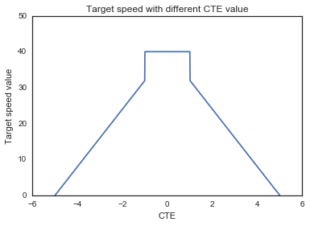
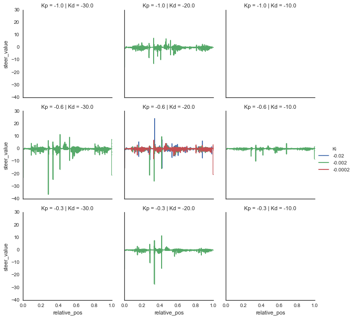

# CarND-Controls-PID
Self-Driving Car Engineer Nanodegree Program

Please run 

```
./pid -p 0.6 -i -2e-3 -d 20 -s 60
```

to get the result with the fastest speed which finished the whole track.


---

## Dependencies

* cmake >= 3.5
 * All OSes: [click here for installation instructions](https://cmake.org/install/)
* make >= 4.1
  * Linux: make is installed by default on most Linux distros
  * Mac: [install Xcode command line tools to get make](https://developer.apple.com/xcode/features/)
  * Windows: [Click here for installation instructions](http://gnuwin32.sourceforge.net/packages/make.htm)
* gcc/g++ >= 5.4
  * Linux: gcc / g++ is installed by default on most Linux distros
  * Mac: same deal as make - [install Xcode command line tools]((https://developer.apple.com/xcode/features/)
  * Windows: recommend using [MinGW](http://www.mingw.org/)
* [uWebSockets](https://github.com/uWebSockets/uWebSockets)
  * Run either `./install-mac.sh` or `./install-ubuntu.sh`.
  * If you install from source, checkout to commit `e94b6e1`, i.e.
    ```
    git clone https://github.com/uWebSockets/uWebSockets 
    cd uWebSockets
    git checkout e94b6e1
    ```
    Some function signatures have changed in v0.14.x. See [this PR](https://github.com/udacity/CarND-MPC-Project/pull/3) for more details.
* Simulator. You can download these from the [project intro page](https://github.com/udacity/self-driving-car-sim/releases) in the classroom.

There's an experimental patch for windows in this [PR](https://github.com/udacity/CarND-PID-Control-Project/pull/3)

## Compilation

### Your code should compile.

```
git clone https://github.com/huboqiang/CarND-PID-Control-Project
mkdir build
cd build
cmake ..
make

./pid -p 0.6 -i -2e-3 -d 30 -s 40
```

## Implementation

### The PID procedure follows what was taught in the lessons.

The algorithm of PID were coded as described in the courses. See `./src/PID.cpp`, line 21-31:

```cpp
void PID::UpdateError(double cte) {
  pid_d  = cte - pid_p;
  pid_p  = cte;
  pid_i += cte;
  timeI += 1;
}

double PID::GetUpdateValue(){
  double updateV = pid_p * Kp + pid_i * Ki + pid_d * Kd;
  return updateV;
}

```

## Reflection

### Describe the effect each of the P, I, D components had in your implementation.

PID stands for Proportional Integral Derivative.

In this project:

- P stands for the distance the car from the center of the road (cte as the program provides). 
- I stands for the running sum of the cte. 
- D stands for the differences between current cte and the previous cte.

The effect PID would effect the results could be concluded as below:

_| Rise time:| Overshoot:| Settling time:| Steady-state error:|Stability:
---|----|----|----|----|----
Kp |decrease| increase |Small change| decrease |degrade
Ki |decrease| increase |increase| decrease| degrade
Kd |minor change| decrease| decrease| No effect |Improve (if small enough)

The effects means:

- Rise time
  - the time it takes to get from the beginning point to the target point
- Overshoot
  - the amount that is changed too much; the value further than the error
- Settling time
  - the time it takes to settle back down when encountering a change
- Steady-state error 
  - the error at the equilibrium
- Stability
  - the “smoothness” of the speed

So, `Kp`, `Ki` and `Kd` need to be tuned to get a better results.

### Describe how the final hyperparameters were chosen.

Briefly speaking, I just choose the parameters mannually because it seemed that I cannot restart the simulating process automatically, which made it hard to make a automatical tuning system.

In details, I used the fixed PID parameters `[-0.1, 0.0, -0.1]` for pid\_throttle controller and tuned parameters for pid\_steer controller. The expected results for the two controller is:

- PID\_throttle:  Control the speed as expected.
- PID\_steer:     Control the cte as low as possible.

#### PID throttle controller

For pid\_throttle controller, the target speed were defined according to the cte value, which means the higher the absolute value of cte, the lower target speed is. See:

```python
import pandas as pd
import matplotlib.pyplot as plt
import seaborn as sns
import numpy as np

sns.set_style("white")
%matplotlib inline

target_speed = 40
np_cte = np.linspace(-5, 5, 1001)
l_ts = []
for cte in np_cte:
    ts = target_speed
    if(abs(cte) > 1.0):
        ts = target_speed * (1-abs(cte)/5.0)
        if(ts < 0):
            ts = 3
            steer_value *= 2
        
    l_ts.append(ts)

        
plt.plot(np_cte, l_ts)
plt.ylim(0,50)
plt.title("Target speed with different CTE value")
plt.xlabel("CTE")
plt.ylabel("Target speed value")
```




#### PID steer value controller

After so many trials, the running logs were recorded for some well performed parameters:

```bash
# Best one
sh ./run.sh -0.6 -2e-3 -20 60   # Fastest
```

The parameters were jittered around the best value, and we lower the target_speed from 60 to 40 to see what happened:

```bash
# test around best parameters. 
sh ./run.sh -0.6 -2e-3 -20 40
sh ./run.sh -1.0 -2e-3 -20 40
sh ./run.sh -0.3 -2e-3 -20 40
sh ./run.sh -0.6 -2e-2 -20 40
sh ./run.sh -0.6 -2e-4 -20 40
sh ./run.sh -0.6 -2e-3 -10 40
sh ./run.sh -0.6 -2e-3 -30 40
```


```python
l_files = ["record_-0.6_-2e-3_-20_40.csv", "record_-1.0_-2e-3_-20_40.csv", 
           "record_-0.3_-2e-3_-20_40.csv", "record_-0.6_-2e-2_-20_40.csv",
           "record_-0.6_-2e-4_-20_40.csv", "record_-0.6_-2e-3_-10_40.csv", 
           "record_-0.6_-2e-3_-30_40.csv"]

l_pdInput = []
for infile in l_files:
    pd_input = pd.read_csv(infile, skiprows=2, header=None, sep="\t")
    pd_input.columns = ['time', "cte", "speed", "steer_value", "angle"]
    pd_input['sample'] = infile
    pd_input['Kp']     = float(infile.split("_")[1])
    pd_input['Ki']     = float(infile.split("_")[2])
    pd_input['Kd']     = float(infile.split("_")[3])
    pd_input['ts']     = float(infile.split("_")[4].split(".")[0])
    pd_input['relative_pos'] = pd_input['time'] / max(pd_input['time'])
    l_pdInput.append(pd_input)
    
pd_out = reduce(lambda x,y: x.append(y), l_pdInput)
pd.pivot_table(pd_out, index=['sample'], aggfunc=[np.var])['var'][['steer_value']].sort_values("steer_value", ascending=False)
```


sample	| 	steer_value
---|---
record\_-0.6\_-2e-3\_-30\_40.csv|1.559561
record\_-0.6\_-2e-2\_-20\_40.csv|0.848560
record\_-0.6\_-2e-3\_-20\_40.csv|0.789631
record\_-1.0\_-2e-3\_-20\_40.csv|0.757942
record\_-0.3\_-2e-3\_-20\_40.csv|0.621460
record\_-0.6\_-2e-4\_-20\_40.csv|0.568196
record\_-0.6\_-2e-3\_-10\_40.csv|0.251302

```python
grid = sns.FacetGrid(pd_out, col="Kd", row="Kp", hue="Ki", size=3)
grid.map(plt.plot, "relative_pos", "steer_value", marker="o", label="Ki", ms=1).add_legend()
```



It can concluded that the best parameters were not too high or too low in this case. For example, If the `Kd` is equal to 10, the variance of steer value would be much lower. When the car run in a high speed, this could result in the lack of turning angle, and the car could run out of the road. However, if `Kd` is equal to 30, the car would turn too much, which would make the passagers not suitable.

